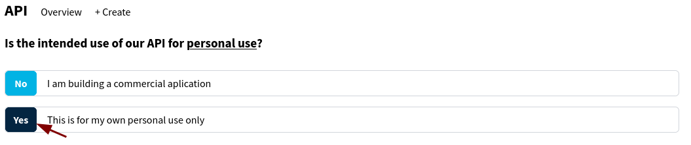

# How to get a TMDB API Token

This guide takes ~2 minutes. You'll need a free TMDB account.

---

## 1. Create an Account

[Login](https://www.themoviedb.org/login) if you already have one, or [register for free](https://www.themoviedb.org/signup) at themoviedb.org.

---

## 2. Request an API Key

Open your [API Settings](https://www.themoviedb.org/settings/api) and click **"click here"** to request an API key.

Select **"Personal use only"** and confirm.

---

## 3. Fill Out the Application

Fill out every required field and press **Subscribe**.

> 🤫 **Tip:** You don't need to enter your real information here.

---

## 4. Copy Your Token

Go back to your [API Settings](https://www.themoviedb.org/settings/api) and copy the **API Read Access Token** (the long one starting with `eyJ`, not the shorter API Key below it).

---

## 5. Paste It Into Streambert

Paste the token into the Streambert setup screen and press **Let's go**. And That's it!

---

## Something not working?

If this guide is outdated or you're running into any issues, please [open an issue](https://github.com/truelockmc/streambert/issues/new) on GitHub.